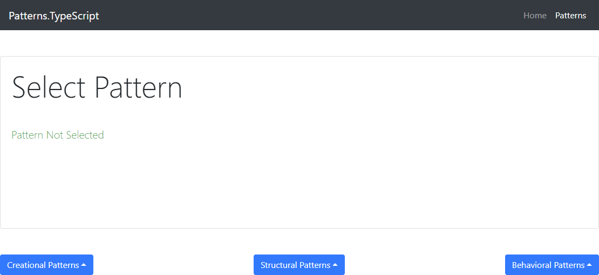

# Patterns.TypeScript
Sample cross-platform app that is built with ASP.NET Core, React, Redux application template from Visual Studio 
to demonstrate 23 GoF design patterns via TypeScript using simplistic samples.

### Prerequisites 
In order to run the application, you need Visual Studio to be up and running on your computer (both PC and MAC are eligible).

### Important
All of the Patterns are located in "ClientApp" => "src" => "patterns" subdirectory. 
The "PatternUseCase" type and the "UseCase" type are related to none of the patterns. 
The above types, as well as all of the others, were created to deliver the output to your 
browser when you run the app and select a pattern.

### Starting Point
Run the project in Visual Studio, click the "Patterns" navigation bar item and use dropdowns to select a pattern.
A relevant "UseCase" execution result is shown as an output in your browser.

